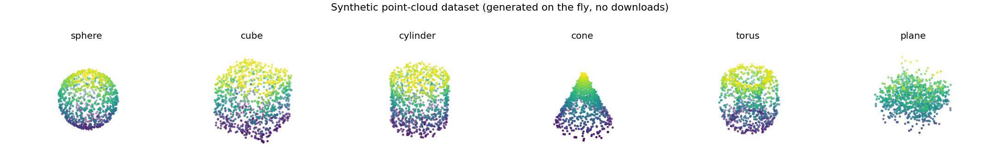
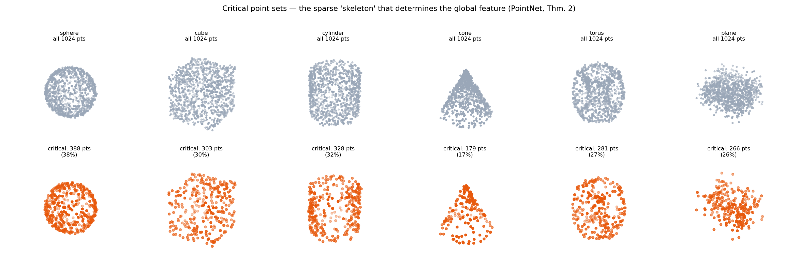
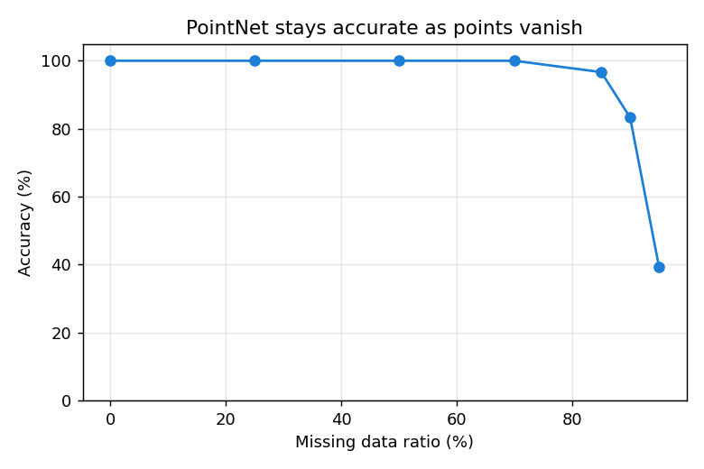

# PointNet from Scratch — and *Seeing* Why It Works

A small, heavily-commented PyTorch implementation of **PointNet**
([Qi et al., CVPR 2017](https://arxiv.org/abs/1612.00593)) — the network that
learns directly on raw 3D point clouds instead of voxels or rendered images.

Most re-implementations stop at "here's the architecture." This one is built to
make the paper's *ideas* visible. It ships with three demos that turn the
paper's three central claims into things you can run and look at:

| Paper's claim | What you can run | Result here |
|---|---|---|
| Point clouds are **sets** → the net must be permutation-invariant | `permutation_invariance.py` | feature deviation across 10 orderings: **0.00e+00** |
| The shape is summarized by a sparse **critical point set** (Thm. 2) | `critical_points.py` | **17–38%** of points determine the prediction |
| Therefore it's **robust to missing data** (Fig. 6) | `robustness.py` | **100%** accuracy with **70% of points deleted** |

And the whole thing runs in **seconds with zero downloads** — the dataset is six
3D primitives generated procedurally, so there's no ModelNet/ShapeNet to fetch.



---

## The one idea behind the whole paper

A point cloud is an *unordered* set of points. A neural network that consumes it
must give the same answer no matter what order the points arrive in. PointNet
achieves this with a single trick (Eq. 1 in the paper):

```
f({x₁, …, xₙ})  ≈  γ( MAX { h(x₁), …, h(xₙ) } )
```

- **`h`** — a small MLP applied *independently and identically* to every point
  (implemented as `1×1` convolutions, so one set of weights touches each point).
- **`MAX`** — element-wise max-pooling across all points. This is the
  *symmetric function*: shuffle the inputs and the max is unchanged. This single
  operation is what makes the network a true set function.
- **`γ`** — an MLP that maps the pooled global feature to class scores.

Two optional **T-Nets** predict little affine matrices that re-align the input
points (and later the features) to a canonical pose before processing.

That's the entire network. ~150 lines in [`pointnet/model.py`](pointnet/model.py).

---

## Why max-pooling gives you the skeleton for free

This is the part worth staring at. Because the global feature is a max over
points, each of its 1024 dimensions is "won" by exactly one input point. The set
of points that win *at least one* dimension is the **critical point set** — and
the paper proves (Theorem 2) that these points *alone* determine the output.

Our encoder returns the `argmax` indices from the pool, so extracting the
critical set is a one-liner. Plot it, and the network's chosen summary of each
shape appears — concentrated on edges, tips, and silhouettes:



Top row: all 1024 input points. Bottom row: only the critical points the network
actually relies on. Look at the **cone** — the net latches onto the apex and the
base rim, exactly the features that distinguish a cone. This sparsity is *also*
the reason PointNet shrugs off missing data:



---

## Quickstart

```bash
git clone <your-fork-url>
cd pointnet-from-scratch
pip install -r requirements.txt

# 1) train the classifier on the synthetic shapes (CPU-friendly)
python -m demos.train_classifier        # saves pointnet.pt

# 2) prove permutation invariance
python -m demos.permutation_invariance

# 3) visualize the critical-point skeletons  ->  assets/critical_points.png
python -m demos.critical_points

# 4) robustness to missing points            ->  assets/robustness.png
python -m demos.robustness
```

No GPU required. The defaults (`512` points, `12` epochs) train in a few minutes
on a laptop and reach ~100% on this dataset; the demos run in seconds.

---

## Repository layout

```
pointnet-from-scratch/
├── pointnet/
│   ├── data.py     # procedural 3D shapes (sphere, cube, cylinder, cone, torus, plane)
│   ├── model.py    # T-Net, shared-MLP encoder, classifier, orthogonality reg. (Eq. 2)
│   └── train.py    # training / evaluation loop
├── demos/
│   ├── train_classifier.py
│   ├── permutation_invariance.py   # the set-function claim, tested
│   ├── critical_points.py          # the Theorem-2 visualization
│   └── robustness.py               # accuracy vs. missing-data ratio
└── assets/         # figures regenerated by the demos
```

---

## A 30-line tour of the model

```python
import torch
from pointnet import PointNetClassifier, make_shape, CLASSES
import numpy as np

model = PointNetClassifier(num_classes=len(CLASSES))
model.load_state_dict(torch.load("pointnet.pt"))
model.eval()

# a cloud is just an (N, 3) array — feed any number of points
cloud = make_shape(label=3, n_points=2048, rng=np.random.default_rng(0))  # a cone
x = torch.from_numpy(cloud).unsqueeze(0)                                   # (1, N, 3)

logits, feat_matrix, critical_idx = model(x)
print("prediction:", CLASSES[logits.argmax(1).item()])

# the points that drive the global feature — the "skeleton"
print("critical points:", len(np.unique(critical_idx.numpy())), "of", x.shape[1])
```

---

## Extending it to real data

The model is dataset-agnostic — it eats any `(N, 3)` tensor. To train on real
scans, swap `ShapeDataset` for a loader that yields normalized point clouds from
**ModelNet40** or **ShapeNet**, and add the segmentation head (concatenate the
global feature back onto each per-point feature, as in Fig. 2 of the paper — the
encoder already exposes everything you need for this).

## Notes & honest caveats

- The synthetic dataset is intentionally easy; it exists so the *concepts* are
  reproducible in seconds, not to claim benchmark numbers. Real point clouds are
  harder, and PointNet's known limitation (no local neighborhood structure) is
  what motivated [PointNet++](https://arxiv.org/abs/1706.02413).
- T-Nets are on by default; toggle with `use_tnet=False` to see their (small)
  effect, mirroring Table 5 in the paper.

## License

MIT. Educational re-implementation; all credit for the method to the original
authors.
